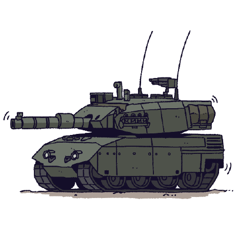

<div align="center">

<table>
  <tr>
    <td align="left" width="60">
      
    </td>
    <td align="center">
      
    </td>
  </tr>
</table> </div>

---

### 👥 Project Members

<table>
  <tr>
    <td align="center" style="border:none;">
      <br />
      <sub><b>qsivey</b></sub>
    </td>
    <td align="center" style="border:none;">
      <br />
      <sub><b>Nik125Y</b></sub>
    </td>
  </tr>
</table>

---

### 🎶 About MicroPlayer

- Lightweight embedded **music player** for microcontrollers.  
- Supports basic playback and simple UI rendering.  
- Designed for **low-resource environments**.  
- Expandable for new formats and features.  

---

### ✨ Features (Template)

- ✅ Play MP3/FLAC/WAV (customizable list)  
- ✅ Metadata parsing (title, artist, album, cover)  
- ✅ Compact and optimized for STM32  
- ✅ Simple and clear UI  

---
<p align="center">    </p> <details> <summary>📷 View More Photos</summary> <p align="center">   </p> </details>
---
<p align="center">     </p> </div> ```
### 📂 Project Structure

```bash
MicroPlayer/
├── src/          # Source code
├── inc/          # Header files
├── Pictures/     # Icons, avatars, device photos
├── docs/         # Documentation
└── README.md     # This file
